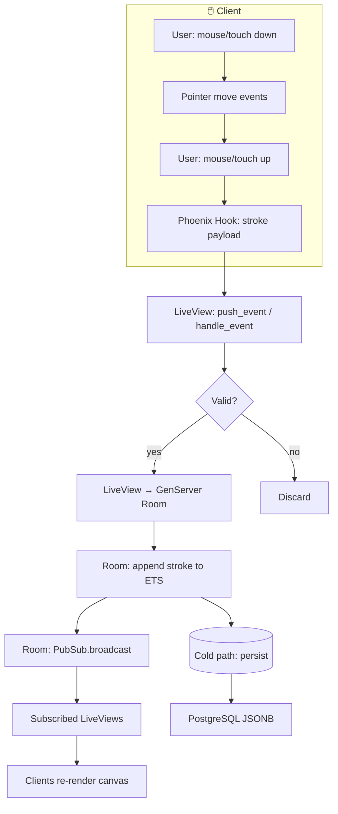

# Ink

**Collaborative whiteboard. Events over pixels.**

---

## Core Philosophy

Ink runs on the **BEAM** because real-time collaboration demands more than fast APIs—it needs a runtime built for **concurrency**, **fault tolerance**, and **soft real-time** guarantees. We treat drawings as an **event-sourced** stream of immutable strokes: every action is an event, every canvas a replay. That gives us **sub-100ms latency** on the hot path and **time-travel** for free.

---

## Key Features

| Feature | Description |
|--------|-------------|
| **Live Collaboration** | Strokes sync across clients via **Phoenix PubSub**. No polling; pure push. |
| **Time-Travel Engine** | Reconstruct canvas state at any point in time by replaying the event log. |
| **Presence & Cursors** | See who’s on the board and where they’re pointing with **Phoenix.Presence**. |
| **Hybrid State** | **ETS** for the hot path (live drawing), **PostgreSQL JSONB** for the cold path (persistence). |

---

## Technical Stack

| Layer | Technology |
|-------|------------|
| Language & Runtime | **Elixir** / **OTP** |
| Web Framework | **Phoenix** |
| Real-Time UI | **Phoenix LiveView** |
| In-Memory Store | **ETS** |
| Messaging | **Phoenix PubSub** |
| Persistence | **PostgreSQL** (JSONB) |

---

## Architecture Deep Dive

```
Client Event  →  Phoenix Hook  →  LiveView  →  GenServer (Room)  →  ETS  →  PubSub  →  Clients
```

1. **Client event** — Pointer/touch input is captured in the browser.
2. **Phoenix Hook** — A **phx-hook** sends drawing events to the LiveView with minimal payload.
3. **LiveView** — Validates and forwards to the **Room** process.
4. **GenServer (Room)** — One process per board; appends the event to **ETS** and broadcasts via **PubSub**.
5. **ETS** — Holds the ordered event stream for the current session; reads are cheap and shared.
6. **PubSub** — Pushes the new event to all subscribed LiveViews (and thus all clients).

Each room is an **OTP process**; the event log is the single source of truth. Playback is just iterating the log up to a given index.

### Stroke lifecycle (flow)



| Step | Description |
|------|-------------|
| **Client** | User draws; **phx-hook** captures pointer events and sends a single stroke payload (e.g. points + tool + color) on pointer up. |
| **LiveView** | Receives the event, validates it, and forwards to the **Room** GenServer. |
| **Room** | Appends the stroke to **ETS** (hot path), broadcasts via **PubSub**, and enqueues or triggers **cold path** persistence to **PostgreSQL**. |
| **Other clients** | Receive the broadcast and replay the new stroke on their canvas. |

---

## Getting Started

```bash
# Install dependencies
mix deps.get

# Create and migrate the database
mix ecto.setup

# Start the Phoenix server
mix phx.server
```

Then open [http://localhost:4000](http://localhost:4000) in your browser.

---

## Learn more

- [Phoenix](https://www.phoenixframework.org/)
- [Phoenix LiveView](https://hexdocs.pm/phoenix_live_view)
- [Phoenix PubSub](https://hexdocs.pm/phoenix_pubsub)
- [ETS](https://www.erlang.org/doc/man/ets.html)
